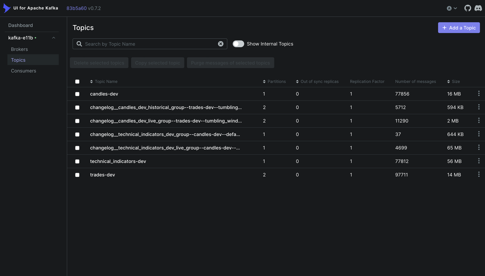
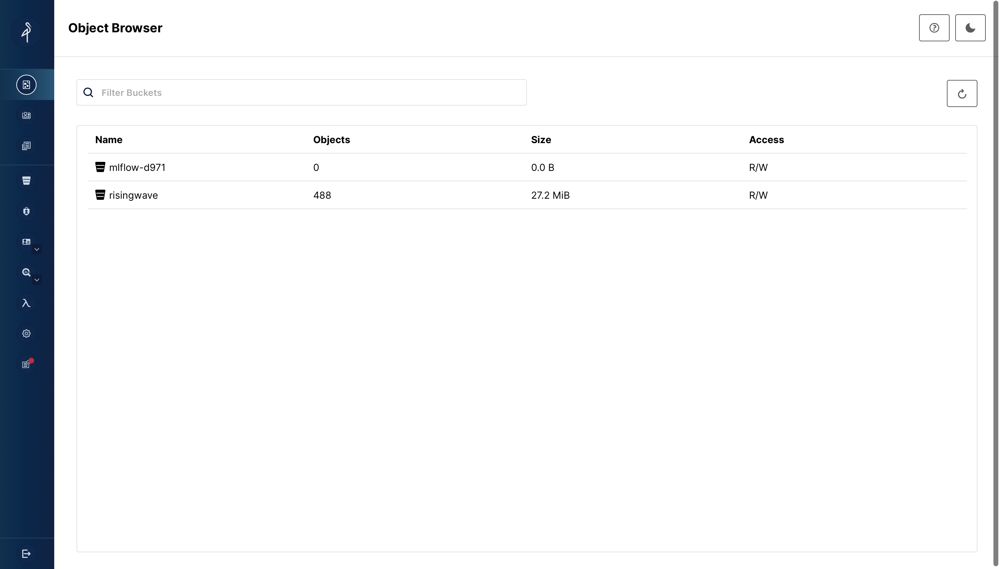
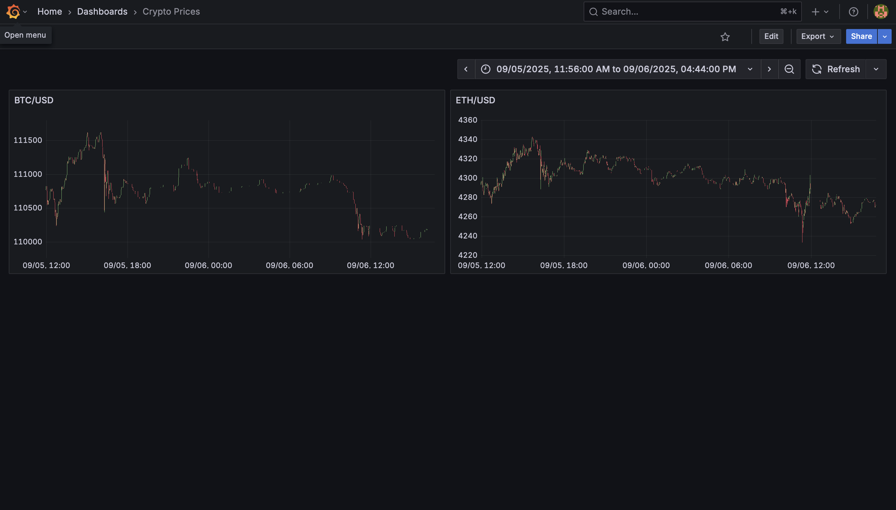

# Real-Time ML Trading System

A comprehensive real-time machine learning system for cryptocurrency trading that processes live market data, computes technical indicators, and provides ML-driven predictions. The system is built with a microservices architecture using Kafka for streaming, RisingWave for real-time analytics, and MLflow for model management.

## 🏗️ System Architecture

The system implements a complete real-time ML pipeline with the following data flow:

```
┌─────────────┐    ┌──────────────┐    ┌─────────────────────┐    ┌──────────────┐
│   Kraken    │───▶│    Trades    │───▶│      Candles        │───▶│  Technical   │
│     API     │    │   Service    │    │     Service         │    │ Indicators   │
└─────────────┘    └──────────────┘    └─────────────────────┘    │   Service    │
                           │                       │              └──────────────┘
                           ▼                       ▼                       │
                   ┌──────────────┐    ┌─────────────────────┐             ▼
                   │    Kafka     │    │       Kafka         │    ┌─────────────────┐
                   │ trades-topic │    │   candles-topic     │    │   RisingWave    │
                   └──────────────┘    └─────────────────────┘    │   Database      │
                                                                  └─────────────────┘
                                                                          │
                                                                          ▼
                                                              ┌─────────────────────┐
                                                              │    Predictions      │
                                                              │     Service         │
                                                              │   (ML Pipeline)     │
                                                              └─────────────────────┘
```

### Core Components

- **Data Ingestion**: Real-time and historical data from Kraken API
- **Stream Processing**: Kafka-based event streaming with multiple processing stages
- **Analytics Database**: RisingWave for real-time SQL analytics and feature serving
- **ML Pipeline**: Technical indicator computation and predictive modeling
- **Model Management**: MLflow for experiment tracking and model registry
- **Object Storage**: MinIO for MLflow artifact storage
- **Monitoring**: Grafana dashboards for system observability

## 🚀 Quick Start

### Prerequisites
- Docker and Docker Compose
- kubectl and kind
- Python 3.13+
- VS Code with Dev Containers extension

### 1. Development Environment Setup
```bash
# Clone and open in VS Code dev container
git clone <repository-url>
cd realtime-ml-system
code .
# Click "Reopen in Container" when prompted
```

### 2. Local Kubernetes Cluster
```bash
# Create kind cluster with all infrastructure
cd deployments/dev/kind
./create_cluster.sh
```

This script automatically sets up:
- Kind cluster with custom networking
- Kafka cluster with UI
- RisingWave database
- MLflow with MinIO storage
- Grafana monitoring

### 3. Verify Infrastructure
```bash
# Check all pods are running
kubectl get pods --all-namespaces

# Access services
kubectl -n kafka port-forward svc/kafka-ui 8182:8080           # Kafka UI
kubectl -n risingwave port-forward svc/risingwave-frontend 4567:4567  # RisingWave
kubectl -n mlflow port-forward svc/mlflow 5000:5000           # MLflow
kubectl -n grafana port-forward svc/grafana 3000:3000         # Grafana
```

### 4. Start Data Pipeline
```bash
# Historical data processing (run sequentially)
make build-and-deploy service=trades env=dev variant=historical
make build-and-deploy service=candles env=dev variant=historical
make build-and-deploy service=technical_indicators env=dev

# Live data processing (after historical completion)
make build-and-deploy service=trades env=dev variant=live
make build-and-deploy service=candles env=dev variant=live
```

## 📊 Infrastructure Components

### Kafka Stream Processing


Kafka serves as the backbone for all real-time data streaming:
- **Topics**: `trades-dev`, `candles-dev`, `technical_indicators-dev`
- **Consumer Groups**: Separate groups for historical vs live processing
- **UI Access**: http://localhost:8182 (after port forwarding)
- **Features**: Topic management, message inspection, consumer monitoring

### MinIO Object Storage  


MinIO provides S3-compatible object storage for MLflow artifacts:
- **MLflow Integration**: Stores model artifacts, experiment data, and metrics
- **Buckets**: Automatically configured for MLflow workspace
- **Access**: Integrated with MLflow authentication
- **Features**: Version control for models, artifact management, secure storage

### Grafana Monitoring


Grafana provides comprehensive system monitoring and observability:
- **Dashboards**: System metrics, application performance, data pipeline health
- **Data Sources**: Prometheus, RisingWave database, application logs
- **Access**: http://localhost:3000 (admin/admin)
- **Features**: Real-time monitoring, alerting, custom dashboards

## 🔧 Services

### [Trades Service](services/trades/README.md)
**Real-time and Historical Data Ingestion**
- Fetches cryptocurrency trade data from Kraken's API
- Dual-mode operation: WebSocket (live) and REST API (historical)
- Configurable trading pairs and data validation
- Kafka producer with JSON serialization

### [Candles Service](services/candles/README.md)  
**OHLCV Candle Aggregation**
- Processes trade streams into OHLCV candles using tumbling windows
- Configurable time intervals with built-in validation
- Non-blocking error handling with graceful degradation
- Supports both historical and live processing modes

### [Technical Indicators Service](services/technical_indicators/README.md)
**Advanced Technical Analysis**
- Computes technical indicators (RSI, MACD, Bollinger Bands, SMA, EMA) using TA-Lib
- Stateful stream processing with configurable candle history
- Automatic RisingWave database integration for real-time analytics
- Configurable indicator periods and sophisticated state management

### [Predictions Service](services/predictions/README.md)
**Machine Learning Pipeline**
- ML-driven trading predictions using technical indicators
- Feature engineering from real-time technical indicator streams
- Model training and inference pipeline
- Integration with MLflow for experiment tracking and model management

## 🏗️ Technology Stack

### Stream Processing
- **Apache Kafka**: Event streaming platform with Strimzi operator
- **QuixStreams**: Python stream processing library for Kafka
- **Kafka UI**: Web-based Kafka management interface

### Databases & Analytics
- **RisingWave**: Real-time SQL analytics database
- **PostgreSQL**: Metadata storage for MLflow and RisingWave
- **Real-time Queries**: SQL-based feature serving for ML models

### Machine Learning
- **MLflow**: Complete ML lifecycle management
  - Experiment tracking and metrics logging  
  - Model registry with versioning
  - Model serving and deployment
- **TA-Lib**: Technical analysis library for financial indicators
- **NumPy**: Numerical computing for data processing
- **Pandas**: Data manipulation and analysis

### Infrastructure
- **Kubernetes**: Container orchestration with kind for local development
- **Docker**: Containerization for all services
- **MinIO**: S3-compatible object storage for MLflow artifacts
- **Grafana**: Monitoring and observability dashboards
- **Prometheus**: Metrics collection and storage

### Development
- **Python 3.13**: Modern Python runtime
- **Pydantic**: Data validation and configuration management
- **Loguru**: Structured logging with JSON support
- **UV**: Fast Python package installer and resolver
- **Ruff**: Lightning-fast Python linter and formatter

## 📈 Data Processing Pipeline

The system processes cryptocurrency data through a sophisticated pipeline:

### Phase 1: Historical Data Processing
Execute these steps **sequentially** to ensure complete historical coverage:

1. **Trades Historical Job**
   ```bash
   make build-and-deploy service=trades env=dev variant=historical
   ```
   - Fetches historical trade data from Kraken REST API
   - Configurable lookback period (default: last N days)
   - Populates `trades-dev` Kafka topic
   - Runs as Kubernetes Job (completes when finished)

2. **Candles Historical Job**
   ```bash
   make build-and-deploy service=candles env=dev variant=historical
   ```
   - Processes all historical trades from topic beginning
   - Uses `auto_offset_reset: earliest` for complete coverage
   - Generates OHLCV candles in `candles-dev` topic
   - Runs as Kubernetes Job with completion tracking

3. **Technical Indicators Service**
   ```bash
   make build-and-deploy service=technical_indicators env=dev
   ```
   - Computes indicators from historical candle data
   - Automatically creates RisingWave database tables
   - Stores results for ML feature serving
   - Runs as Deployment (continuous processing)

### Phase 2: Live Data Processing  
After historical processing completes, start live services:

4. **Trades Live Service**
   ```bash
   make build-and-deploy service=trades env=dev variant=live
   ```
   - Continuous WebSocket connection to Kraken
   - Real-time trade data streaming
   - Seamlessly appends to existing historical data

5. **Candles Live Service**
   ```bash
   make build-and-deploy service=candles env=dev variant=live
   ```
   - Processes live trades into real-time candles
   - Separate consumer group prevents conflicts
   - Continuous OHLCV generation

### Architecture Features
- **Separate Consumer Groups**: Historical and live modes use different groups
- **Gap Prevention**: Sequential execution ensures no data gaps
- **Mode Detection**: Services auto-detect historical vs live configuration
- **State Management**: Maintains processing state across service restarts
- **Error Handling**: Graceful degradation with comprehensive logging

## 🔍 Monitoring & Verification

### Data Pipeline Health Checks
```bash
# Verify technical indicators in RisingWave
PGPASSWORD=123456 psql -h localhost -p 4567 -d dev -U root -c "
SELECT pair, close, rsi_14, sma_21, macd_7, 
       window_start_ms, to_timestamp(window_start_ms / 1000) as time 
FROM technical_indicators 
ORDER BY window_start_ms DESC 
LIMIT 10;"

# Check Kafka topics have data
kubectl -n kafka exec -it kafka-cluster-kafka-0 -- \
  /opt/kafka/bin/kafka-console-consumer.sh \
  --bootstrap-server localhost:9092 \
  --topic trades-dev \
  --from-beginning --max-messages 5

# Monitor service pods
kubectl get pods -l app=trades -n default
kubectl get pods -l app=candles -n default
kubectl get pods -l app=technical-indicators -n default
```

### Performance Monitoring
```bash
# RisingWave table statistics
PGPASSWORD=123456 psql -h localhost -p 4567 -d dev -U root -c "
SELECT 
    COUNT(*) as total_indicators,
    COUNT(DISTINCT pair) as trading_pairs,
    MIN(window_start_ms) as earliest_data,
    MAX(window_start_ms) as latest_data,
    MAX(window_start_ms) - MIN(window_start_ms) as data_range_ms
FROM technical_indicators;"

# Kafka consumer lag monitoring
kubectl -n kafka exec -it kafka-cluster-kafka-0 -- \
  /opt/kafka/bin/kafka-consumer-groups.sh \
  --bootstrap-server localhost:9092 \
  --describe --all-groups
```

## 🛠️ Development Workflow

### Local Development
```bash
# Run services locally (development mode)
make dev service=trades
make dev service=candles  
make dev service=technical_indicators

# Lint and format code
make lint

# Build and push images
make build-and-push service=trades env=dev
```

### Debugging
```bash
# View service logs
kubectl logs -f deployment/trades-live -n default
kubectl logs -f deployment/candles-live -n default
kubectl logs -f deployment/technical-indicators-live -n default

# Debug Kafka connectivity
kubectl -n kafka exec -it kafka-cluster-kafka-0 -- \
  /opt/kafka/bin/kafka-topics.sh \
  --bootstrap-server localhost:9092 --list

# Test RisingWave connection
kubectl -n risingwave exec -it risingwave-frontend-0 -- \
  psql -h risingwave-frontend -p 4567 -d dev -U root
```

### Service Management
```bash
# Shutdown services
make shutdown service=trades env=dev variant=live
make shutdown service=candles env=dev variant=live
make shutdown service=technical_indicators env=dev

# Scale deployments
kubectl scale deployment trades-live --replicas=2
kubectl scale deployment candles-live --replicas=2
```

## 🔧 Configuration

### Environment-Specific Settings
Each service supports environment-specific configuration:
- **Development**: `local.env` files for local development
- **Production**: Kubernetes ConfigMaps and Secrets
- **Validation**: Pydantic-based configuration validation

### Service Configuration Patterns
- **Kafka Settings**: Broker addresses, topic names, consumer groups
- **Processing Modes**: Historical vs live processing detection
- **Database Connections**: RisingWave and PostgreSQL connectivity
- **Indicator Parameters**: Configurable periods and calculation windows

## 🚨 Troubleshooting

### Common Issues

**Services not starting**
- Check Kubernetes cluster status: `kubectl get nodes`
- Verify all infrastructure pods are running: `kubectl get pods --all-namespaces`
- Check service logs: `kubectl logs -f deployment/<service-name>`

**No data in RisingWave**
- Verify Kafka topics have data: Use Kafka UI at http://localhost:8182
- Check consumer group offsets and lag
- Ensure services are processing data: Check service logs for processing messages

**Historical processing stuck**
- Monitor job completion: `kubectl get jobs`
- Check pod resources: `kubectl describe pod <job-pod-name>`
- Verify Kraken API connectivity and rate limits

**Performance Issues**
- Monitor resource usage: `kubectl top pods`
- Check Kafka consumer lag: Use Kafka UI consumer groups tab
- Review service configuration for optimal settings

### Support
- Check individual service README files for detailed troubleshooting
- Monitor Grafana dashboards for system health metrics
- Use kubectl commands for pod inspection and log analysis

## 📚 Additional Resources

### Service Documentation
- [Trades Service](services/trades/README.md) - Data ingestion from Kraken API
- [Candles Service](services/candles/README.md) - OHLCV candle aggregation  
- [Technical Indicators Service](services/technical_indicators/README.md) - Technical analysis computation
- [Predictions Service](services/predictions/README.md) - ML pipeline and predictions

### Infrastructure Components
- **Kafka**: Stream processing and message queuing
- **RisingWave**: Real-time analytics database
- **MLflow**: ML experiment tracking and model management
- **MinIO**: Object storage for ML artifacts
- **Grafana**: System monitoring and observability

## 🤝 Development Container

This repository uses a dev container for consistent development environments:

### Base Setup
- **Base image**: `python:3.13-bookworm`
- **Installed tools**: uv, ruff, mypy, bandit, Docker-in-Docker, tmux, pre-commit, mise
- **Kubernetes tools**: kind, kubectl, helm, k9s, kustomize
- **VS Code extensions**: Python, Pylance, Jupyter, isort

### Usage
1. Install the "Dev Containers" VS Code extension
2. Open this repo in VS Code  
3. Click "Reopen in Container" when prompted

The container automatically configures the development environment and mounts SSH keys for seamless development.